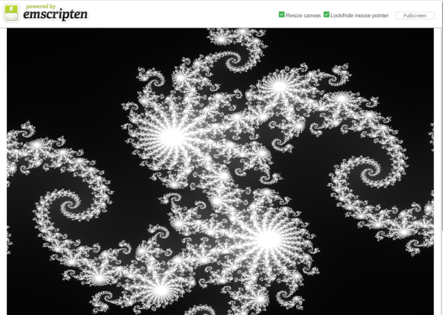

# Julia.wasm

Simple WebAssmebly Juliaset renderer. Based on https://github.com/ali-raheem/Julia

## Screenshots

## Dependencies

* emscripten for webassmebly
* SDL2 emscripten handles this or install the development files.

## Building/Running

### Webassmebly

`emcc src/main.c -s USE_SDL=2 -s WASM=1 -o out/main.html`

Then serve the files

`emrun --no_browser --port 5000 out/`

Make sure 'resize canvas' is checked.

### Native binary

`gcc src/main.c -o out/main -lSDL2 -lm`

Will look hacky as we render as we generate data. This is for no real reason emscripten allows malloc could use a buffer.

### Performance

Some low hanging fruit here especially on PC for OMP.

#### Todo

* Maintain a buffer then render from there will allow MP
* Colour not just greyscale.